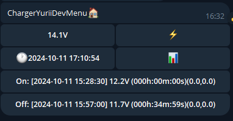

Android app for interactive and history charts see here:

```bash
   git clone  https://github.com/YBalan/ChargerCharts2
```

Based on ESP32 and [XY-DJ](https://www.aliexpress.com/item/1005003057522404.html?albagn=888888&&src=google&albch=search&acnt=479-062-3723&isdl=y&aff_short_key=UneMJZVf&albcp=21526361237&albag=168530015987&slnk=&trgt=dsa-1642801257570&plac=&crea=707770237669&netw=g&device=c&mtctp=&memo1=&albbt=Google_7_search&aff_platform=google&gad_source=1&gclid=CjwKCAiAxqC6BhBcEiwAlXp459KC3oweyhTdCSlc5U3-XM9VPL8W8snE2UbfG6-eGj6bu7oxM5q_3RoCMAIQAvD_BwE&gclsrc=aw.ds) allow to see battery voltage in real time in Telegram bot and Android app (see above)


